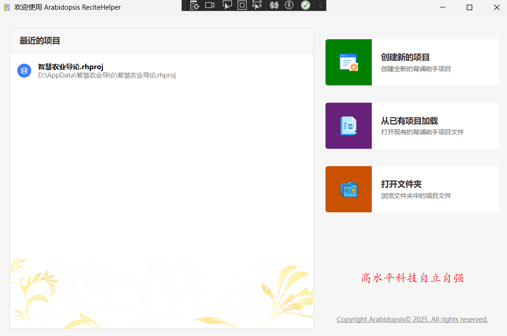
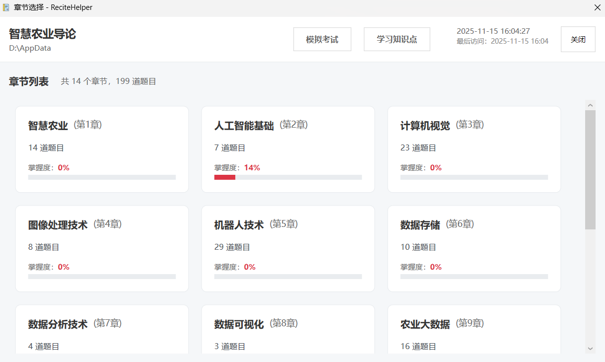
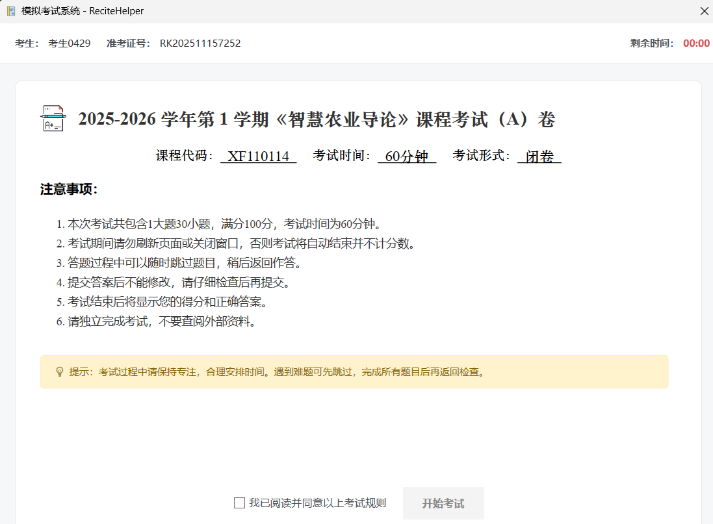

# ReciteHelper 用户手册

**版本号：v2**

**更新日期：2025.11.15**

## 简介
ReciteHelper 是一款AI驱动的、旨在帮助用户高效记忆和复习知识内容的工具。通过提供多种学习与复习方法，该项目可以辅助用户管理、巩固和测试自己的学习内容，尤其适用于考试、背诵和知识点梳理等应用场景。本项目支持多种类型的数据输入与输出，并可根据用户需求进行灵活定制。

---
## 使用之前

使用之前，您应该先完成软件的配置。使用记事本或者其他文本编辑器打开文件目录下的Config.xml文件，可以看下如下内容：

```xml
<Config>
	<Version>2</Version>
	<DeepSeekKey>%Environment.GetEnvironmentVariable("DSAPI")%</DeepSeekKey>
	<OCRAccess></OCRAccess>
	<OCRSecret></OCRSecret>
</Config>
```

必须配置项是 `DeepSeekKey`，从官网的开发平台获取 Key 后（格式：`sk-xxxxxxxxxxxxxxxxxxxxxxxxxxxxxxxx`），直接替换其中的%符号和其中的所有字符，改为这个 Key 即可。

当然，如果担心安全问题，您可以将 Key 配置到环境变量中，之后将 `%Environment.GetEnvironmentVariable("DSAPI")%` 中的 DSAPI 改为自己配置的环境变量名称。

---

## 功能
### 创建项目
本软件以“学科”为单位组织复习项目，您应该为每一门不同的学科创建一个新的复习项目。

在主界面点击“创建新的项目”即可创建一个学科复习项目。你需要准备这么学科的复习资料pdf格式文件，这份pdf应该是文字，而不是图片。文件的图片支持（OCR光学识别或多模态方法）将在后续版本中更新。



之后，填写课程名称、项目保存路径和复习资料路径，点击“确认创建”即可。软件将自动提取文档文字进行智能分析和聚类。这个过程可能耗时较长，耐心等待直到出现提示框即可。之后再选择“从已有项目加载”，之后选择创建项目路径打开。之后该项目将会出现在最近项目列表中，可以直接点击打开。

### 知识点学习

打开项目之后将会弹出章节选择窗口，显示通过复习资料分割而来的所有章节。



此时通过右上角的“学习知识点”按钮即可打开知识点学习页面，该页面罗列了聚类后的每一个章节以及章节内的所有知识点。点击左侧章节名称即可展开知识点页面，之后点击具体知识点就可以查看知识点内容。当掌握该知识点后，可以点击右上角的“标记为已掌握”，此时该知识点的状态将自动更新为“已掌握”，并在显示时显示一个打钩的复选框。如果复习时发现该知识点忘记，反选右上角即可标记为未掌握状态。切换新知识点时可能发生一次闪烁，这是因为渲染文本造成的，属正常现象。

为方便更好的复习知识点，软件将在未来提供基于Ebbinghaus遗忘曲线的知识点复习推荐与掌握度检测。


### 题目练习

在学习了一部分知识点后，可以在章节选择界面，选择需要练习的章节，此时将打开对应章节的做题界面。


目前支持填空题，将在不久后支持选择题、解释题、简答题等诸多题型。在答案框输入答案后点击“提交答案”，软件将判断答案是否正确并记录。不同于市面上常见软件的错一个字就算答案错，我们引入了包括但不限于LCS、相关系数、TF-IDF、余弦相似度等诸多方法接受不同或模糊的答案。比如在图中，正确答案是像素，输入的像素点与像素意义是相近的，所以该答案被接受，并判定为回答正确。退出软件后，也会完整保存答题进度，再次进入可继续答题。同时，答题数据也会被用于计算掌握度并显示在章节选择界面，供给复习参考使用。

### 模拟考试

为了模拟考试环境，软件搭载了模拟考试功能。当前版本下模拟考试将自动从各个考点中随机抽取30道题目，限时60分钟完成。后续版本将支持自定义题目类型，双向细目表出题等。点击选择章节右上角的“模拟考试”页面进入模拟考试，之后会打开考试配置界面。


在该页面中，可以配置考试的相关设置，例如课程号、考试时间、考试题量、每题分数等。可以通过右侧的各个滑块从知识点按照比例进行抽题，总权重不必保证为100%，软件会自动计算权重比例进行抽题。



选择“我已阅读并同意以上考试规则”后，便可以开始考试。完成题目后点击右上角的交卷按钮，便可查看自己的成绩和错题。


点击“查看答案”按钮后，将打开考试答案回顾窗口，可以查看各个题目的作答情况、正确答案和解析。当然也可以选择再考一次，检验本次考试知识是否得以掌握。


---

## 常见问题（FAQ）

**Q：项目创建后没有出现章节怎么办？**  
A：请确认所上传的PDF是否为可识别文字内容，图片型PDF暂不被当前版本支持。建议使用文字版PDF文档。

**Q：知识点标记为已掌握后如何再次复习？**  
A：在知识点学习页面可以通过筛选功能切换显示“全部”、“已掌握”、“未掌握”的知识点，自主选择复习内容。

**Q：如何导出学习进度？**  
A：可在“项目设置”中选择导出，支持json格式，便于进度管理和数据分析。

---

## 更新日志

### v2（2025.11.15）
- 增加回顾考试题目功能
- 增加知识点学习功能
- 添加文档与规范

（v2版本仍在开发中）

### v1（2025.11.11）
- 支持PDF导入与知识点自动聚类  
- 增加模拟考试功能  
- 优化自动聚类与章节识别算法  
- 支持相似答案模糊判定技巧  

---

## 联系我们与反馈

- 软件主页：[GitHub 项目工程](https://github.com/ArabidopsisDev/ReciteHelper)
- 问题反馈邮箱：arab@methodbox.top
- 用户交流群：1053379975
- 欢迎在issue，或者直接邮件提出建议与问题，开发团队将及时答复

---