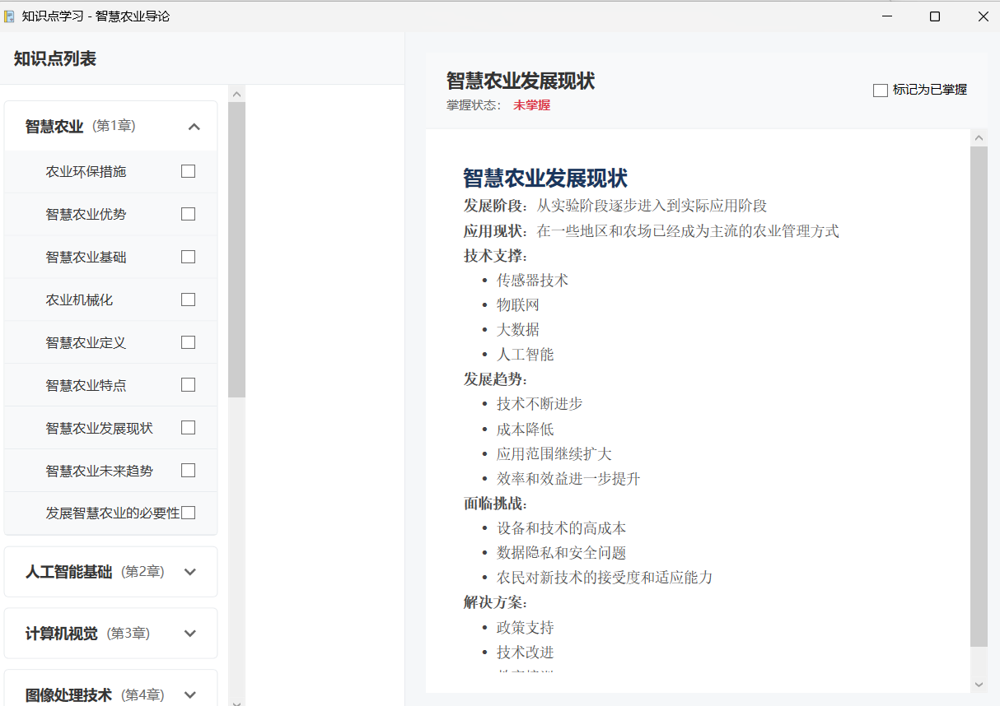
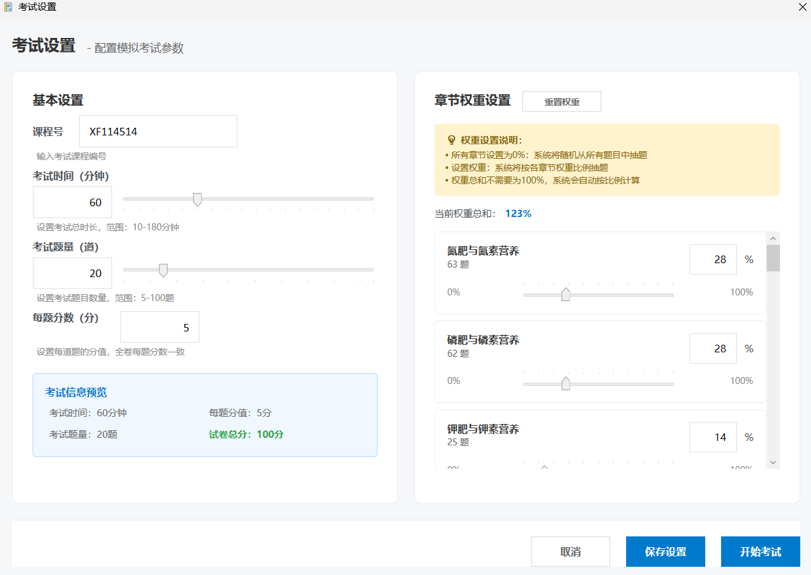
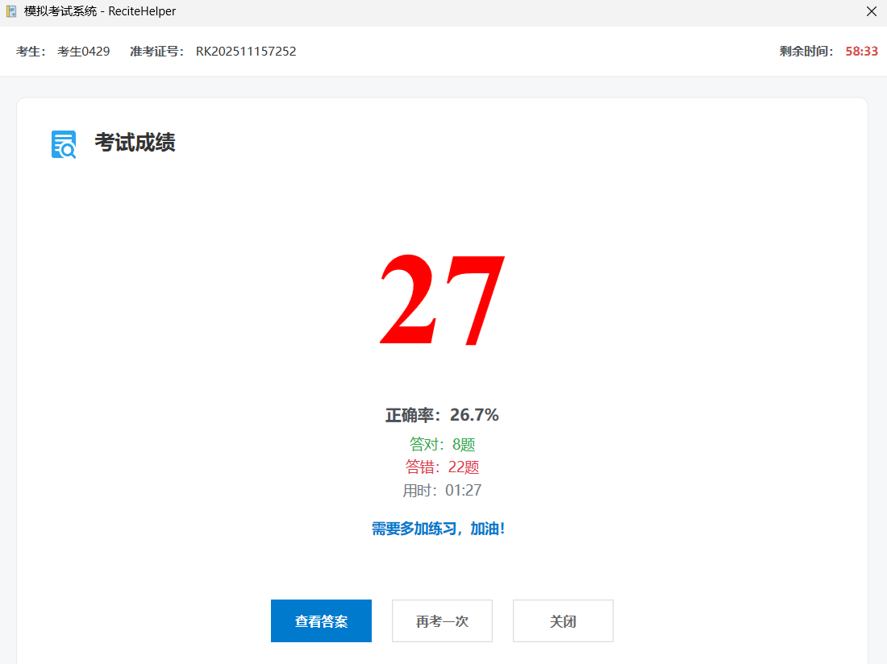

# ReciteHelper User Manual

**Version:** v3-preview

**Last Updated:** 2025.12.30

## Introduction
ReciteHelper is an AI-powered tool designed to help users efficiently memorize and review knowledge content. By providing various study and review methods, this project assists users in managing, reinforcing, and testing their study material. It is especially suitable for exam preparation, memorization, and knowledge point organization. The project supports multiple types of data input and output and can be flexibly customized according to users' needs.

---

## Before Use

Before using the software, you should complete the configuration. Open the Config.xml file in the file directory using Notepad or another text editor. You will see the following content:

```xml
<Config>
<Version>2</Version>
<DeepSeekKey>%Environment.GetEnvironmentVariable("DSAPI")%</DeepSeekKey>
<MissingStrategy>Ignore</MissingStrategy>
<OCRAccess></OCRAccess>
<OCRSecret></OCRSecret>
</Config>
```

The required configuration item is `DeepSeekKey`. After obtaining the Key from the official website's developer platform (format: `sk-xxxxxxxxxxxxxxxxxxxxxxxxxxxxxxxx`), directly replace the `%` symbols and all the characters within them with this Key.

Of course, if you are concerned about security issues, you can configure the Key in your environment variables, and then change `DSAPI` in `%Environment.GetEnvironmentVariable("DSAPI")%` to the name of your configured environment variable.

The `MissingStrategy` configuration item indicates the behavior if some knowledge points are discarded due to AI hallucinations. The default is `Ignore`. `Ignore` means no action is taken after discarding, which may result in less than 10% loss of knowledge points, but the speed is relatively faster; `Replay` means that the discarded knowledge points are extracted and replayed, ensuring that all content is retained, but this may take more time.

---

## Features

### Create Project

The software organizes review projects by "Subject." You should create a new review project for each different subject.

On the main interface, click on "Create New Project" to start a subject review project. You should prepare a PDF file with the review material for the subject. This PDF should contain selectable text, not images. Support for image-based files (OCR or multimodal methods) will be added in future releases.


Afterward, fill in the course name, project save path, and review material path, and click "Confirm Create." The software will automatically extract the text from the document and perform intelligent analysis and clustering. This process may take some time, so please wait patiently until a prompt appears. Then, select "Load from Existing Project" and choose the path to the newly created project. The project will then appear in the recent projects list and can be opened directly.

### Knowledge Point Learning

After opening the project, a chapter selection window will pop up, displaying all chapters divided from the review materials.


Click the "Learn Knowledge Points" button at the top right to open the knowledge point learning page. This page lists each cluster-generated chapter and all knowledge points within it. Clicking a chapter name on the left will expand the knowledge point list. Click on a specific knowledge point to view its content. Once you have mastered a knowledge point, you can click "Mark as Mastered" at the top right, and its status will update to "Mastered" with a checkmark. If you forget a knowledge point during review, you can uncheck the mark to set it as "Not Mastered." There may be a flash when switching knowledge points due to text rendering, which is normal.

To better support review, future versions will offer knowledge point revision recommendation and mastery detection based on the Ebbinghaus forgetting curve.



### Practice Questions

After learning some knowledge points, you can select chapters to practice questions from the chapter selection interface, which opens the question practice page for that chapter.


Currently, fill-in-the-blank questions are supported, with plans to add multiple-choice, explanation, and short-answer questions. Enter your answer in the answer box and click "Submit Answer." The software will determine if the answer is correct and record your progress. Unlike common applications that mark answers wrong for minor differences, our software accepts similar or fuzzy answers using methods such as LCS, correlation coefficient, TF-IDF, cosine similarity, etc. For example, in the figure, the correct answer is "pixel," and "pixel point" is accepted and judged as correct since their meanings are close. Your answer progress is saved, and you can continue answering after exiting the software. Answer data will also be used to calculate mastery and displayed on the chapter selection for reference.

### Mock Exam

To simulate the exam environment, the software includes a simulated exam function. In the current version, the simulated exam will automatically randomly select 30 questions from various test points, with a time limit of 60 minutes. Subsequent versions will support custom question types, two-way item analysis question generation, etc. Click on the "Simulated Exam" page in the upper right corner of the chapter selection to enter the simulated exam, which will then open the exam configuration interface.



On this page, you can configure relevant exam settings, such as course number, exam time, number of questions, points per question, etc. You can use the sliders on the right to select questions from knowledge points proportionally. The total weight does not need to be 100%; the software will automatically calculate the weight ratio for question selection.


After selecting "I have read and agree to the above exam rules," you can start the exam. After completing the questions, click the submit button in the upper right corner to view your score and incorrect answers.



Clicking the "View Answers" button will open the exam answer review window, where you can view your answers to each question, the correct answers, and explanations. You can also choose to take the exam again to test your understanding of the knowledge covered in this exam.


---

## Frequently Asked Questions (FAQ)

**Q: No chapters appear after creating a project. What should I do?**  
A: Please check if the uploaded PDF contains selectable text. Image-only PDFs are not supported in the current version. Use text-based PDF documents.

**Q: How can I review knowledge points marked as mastered?**  
A: On the knowledge point learning page, you can filter to show "All," "Mastered," or "Not Mastered" knowledge points and freely select what to review.

**Q: How do I export my learning progress?**  
A: In "Project Settings," you can export learning data in JSON format for progress management and data analysis.

---

## Changelog

### v3-preview (2025.12.29)
- Added custom exam functionality
- Added support for long PDFs using a replay algorithm

(v3 is still under development)

### v2 (2025.11.15)
- Added review answer feature for mock exams
- Added knowledge point learning function
- Added documentation and specifications


### v1 (2025.11.11)
- Support PDF import and automatic knowledge clustering
- Added mock exam function
- Improved clustering and chapter recognition algorithms
- Supported fuzzy answer matching

---

## Contact Us & Feedback

- Project Homepage: [GitHub Repo](https://github.com/ArabidopsisDev/ReciteHelper)
- Feedback Email: arab@methodbox.top
- User Community Group: 1053379975
- Feel free to open an issue or send an email with suggestions or questions. The development team will respond promptly.