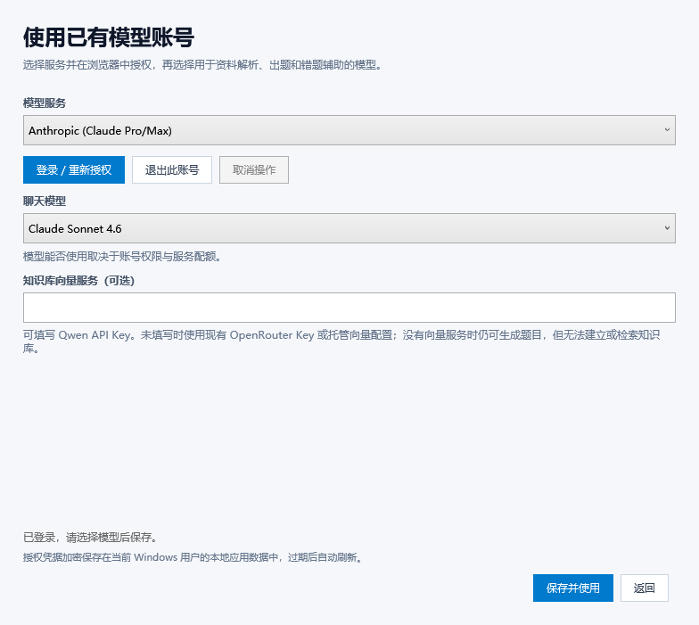

# 模型账号 OAuth / Model-account OAuth

本实现使用 [pi-ai README](https://github.com/earendil-works/pi/blob/main/packages/ai/README.md) 中的 provider、`Models.login()`、`CredentialStore` 和自动鉴权接口，固定依赖 `@earendil-works/pi-ai@1.1.0`。没有复制服务商的客户端 ID、PKCE、设备码轮询或刷新协议。

## 使用方法

1. 安装 [Node.js 22.19 或更新版本](https://nodejs.org/)，确保 `node` 在 PATH 中。
2. 在首次模型选择窗口点击“使用已有模型账号授权（OAuth）”，或从主界面点击“模型服务”进入。
3. 选择服务并点击“登录 / 重新授权”。按 pi 提示在浏览器中授权、输入设备码，或提交回调 URL / 授权码。支持文本、密码、选项和手动回调输入；浏览器回调成功时会自动取消未完成的手动输入。
4. 选择聊天模型，按需填写知识库的 Qwen Key，点击“保存并使用”。



账号权限、订阅、可用模型与配额由对应服务决定。GitHub Copilot 的某些模型需先在 VS Code 中启用，参见上游 README 的 Provider notes。退出账号会移除本机凭据；服务端撤销授权可在服务商的账号设置中完成。

## 支持列表

列表由 `models.getProviders().filter(provider => provider.auth.oauth)` 生成，模型使用 `getModels()` / `getAvailable()` 并应用 pi 的账号权限过滤与动态 catalog 刷新。锁定版本包含以下九项：

| Provider ID | 账号授权 |
| --- | --- |
| `anthropic` | Anthropic / Claude |
| `openai` | Sign in with ChatGPT |
| `openai-codex` | OpenAI Codex（上游标记为 legacy） |
| `github-copilot` | GitHub Copilot，含上游支持的 Enterprise 流程 |
| `kimi-coding` | Kimi Code |
| `meta` | Meta |
| `openrouter` | OpenRouter PKCE，生成由用户控制的长期 API Key |
| `radius` | Radius |
| `xai` | xAI / Grok |

Google Vertex AI 的 ADC 是上游的 ambient/API-key 认证能力，不是 `auth.oauth` 登录项。已经从当前 pi 版本移除的 Gemini CLI / Antigravity 没有作为可用服务列出。新增 OAuth provider 时，应升级锁定依赖并检查 pi 的 bundle OAuth loader 注册表和测试。

## 向量服务与配置

pi 没有统一的 embedding 操作。OAuth 模式下，文本请求经 pi 路由，向量服务依次选择 `QwenKey`、`OpenRouterKey`、托管服务配置。均未配置时，生成题目照常运行，知识库构建会显示缺少向量服务的提示；查询现有知识库也需要相应向量服务。

`Config.xml` 新增两个非敏感字段：

```xml
<PiOAuthProvider>openai</PiOAuthProvider>
<PiOAuthModel>在界面中选择的模型 ID</PiOAuthModel>
```

两项均填写时，OAuth 聊天配置优先于旧 API Key。选择旧的直连、OpenRouter Key 或托管方案会清除这两个字段。旧配置文件可继续读取。向量模型变化仍使用原有的知识库重建逻辑。

## 凭据与取消

WPF 主机拥有持久化存储，使用 Windows DPAPI `CurrentUser` 加密整个凭据 map 与安装 ID，并原子替换 `%LOCALAPPDATA%/ReciteHelper/pi-oauth.dat`。服务商额外字段原样保留；token 不进入 XML、命令行、临时明文文件或进程错误日志。安装 ID 在不同授权与启动之间保持稳定，提供给 pi 的 `LoginOptions.getDeviceId()`。

Node bridge 实现 `CredentialStore.read/list/modify/delete`，持久化消息必须得到 WPF 主机的保存确认后才能完成。主机在每个操作期间持有跨进程文件锁，bridge 的 `modify` 还按顺序执行，防止多个窗口或应用实例同时刷新已轮换的 token。OAuth 请求在当前实现中按顺序执行，这是用完整操作锁保护跨进程凭据一致性的代价；10 分钟请求超时从取得锁后开始计时，批量任务排队不会消耗单个请求的时间预算。失败的刷新不会清空原凭据或回退到环境变量密钥。

取消会传给 pi 的 AbortSignal；已经开始的 token 刷新按上游约定先完成持久化。主机允许最多 25 秒退出宽限，然后终止整个子进程树，避免遗留回调服务器。解密失败会保留原文件并提示恢复，不会静默覆盖。

## 构建和测试

```powershell
git submodule update --init --recursive
dotnet build src/ReciteHelper.slnx --configuration Release
npm --prefix tools/pi-bridge test
dotnet test tests/ReciteHelper.OAuth.Tests/ReciteHelper.OAuth.Tests.csproj --configuration Release --no-build
dotnet publish ReciteHelper.Wpf/ReciteHelper.Wpf.csproj --configuration Release --runtime win-x64 --self-contained false
```

WPF 的 MSBuild target 自动执行锁文件恢复与 esbuild 打包，输出 `pi/bridge.mjs`、license comments 和完整第三方许可证。bundle 含 pi 的全部官方 OAuth flow，运行时不需要 npm 或 node_modules。运行时仍需 Node.js 22.19+；可设置 `RECITEHELPER_NODE_PATH` 指向 node.exe，或在发布目录的 `pi/` 中提供 node.exe。

测试覆盖九个 provider 与模型 catalog、所有 OAuth flow 模块加载、真实 `Models` 的并发刷新/鉴权、取消期间的 token 持久化、失败保留、退出与模型过滤，以及 Windows DPAPI、跨实例锁、手动回调取消、UTF-8 大响应和脱离 npm 安装的 bundle。测试使用合成凭据和 pi 的 faux provider；真实账号授权与计费模型请求仍需在各服务的账号上验证。
