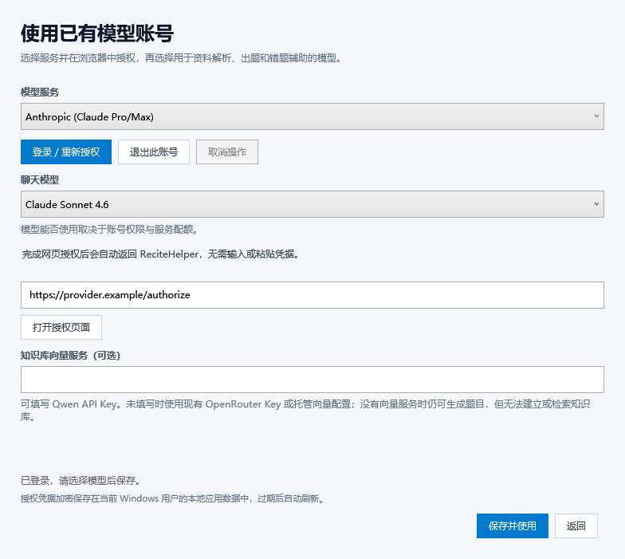

# 原生 C# 模型账号 OAuth

按照 [pi-ai README](https://github.com/earendil-works/pi/blob/main/packages/ai/README.md) 的授权能力，参考 pi-ai 1.1.0 的 `auth/oauth` 与 `api` 源码，将所需的 OAuth 和文本请求协议移植到 C#。构建、运行与测试均使用 .NET，无需 Node.js、npm、JavaScript bridge 或子进程。派生协议和模型目录保留 [pi 的 MIT 许可证](../ReciteHelper.Infrastructure/OAuth/PI-LICENSE.txt)。

## 使用方法与自动返回

1. 在首次配置窗口点击“使用已有模型账号授权（OAuth）”，或从主界面点击“模型服务”进入。
2. 选择服务并点击“登录 / 重新授权”，在自动打开的浏览器中完成授权。
3. 浏览器授权通过本机 loopback 回调自动返回，授权窗口会恢复并进入前台，无需复制授权码、回调 URL 或粘贴 token。
4. 选择聊天模型，按需填写知识库的 Qwen Key，点击“保存并使用”。




使用设备码的服务会自动轮询授权结果，并在完成后回到应用。优先打开服务端提供的 `verification_uri_complete`；不提供该地址的服务可能要求在其网页输入一次性验证码。GitHub 个人账号可直接登录；Enterprise 用户可预先填写可选的企业主机名，不要求输入账号密码或 API token。

## 九个支持的服务

| Provider ID | 授权与刷新方式 |
| --- | --- |
| `anthropic` | 浏览器 PKCE、loopback 回调、刷新 token |
| `openai` | Sign in with ChatGPT；动态签发 client ID，校验直接调用模型的 scope |
| `openai-codex` | Codex 浏览器 PKCE；端口占用时自动切换设备码；保留账号 ID |
| `github-copilot` | GitHub / Enterprise 设备授权、Copilot token、账号代理与模型权限过滤 |
| `kimi-coding` | Kimi Code 设备授权与 token 刷新，重试临时服务错误 |
| `meta` | Meta 设备授权、身份 token 换取 Model API key，到期重新生成 key |
| `openrouter` | 浏览器 PKCE 换取长期 API key，不需要周期刷新 |
| `radius` | 浏览器 PKCE；端口占用时切换设备码，加载账号的动态模型目录 |
| `xai` | xAI 设备授权与刷新，未轮换时保留原 refresh token |

账号权限、订阅、配额与可用模型由服务商决定。模型目录内嵌 pi-ai 1.1.0 的 546 个聊天模型，涉及 Anthropic Messages、OpenAI Chat Completions、OpenAI Responses、Codex Responses 和 pi-messages 五种请求协议。Copilot 使用账号可用模型列表，Radius 使用服务端目录并缓存到加密存储。后续 pi 协议或目录变化需相应更新 C# 实现与版本快照。

## 回调安全与取消

原生 TCP listener 仅监听 `127.0.0.1`，无需管理员权限或 HTTP.sys URL 预留。回调校验路径、随机 state、授权码以及 OpenAI 签发的 client ID；不匹配的请求不会消耗本次授权，同一次回调只接受一次。OpenRouter 使用随机回调路径与 PKCE。完成、取消或失败都会停止 listener 并关闭连接。

Anthropic 优先使用 53692，端口占用时使用空闲端口；OpenAI 与 Codex 使用 1455，Radius 使用 1456。OpenAI 的动态客户端流程要求固定端口，冲突时会提示关闭其他未完成登录；不会把授权结果交给占用端口的其他程序。Codex / Radius 可自动切换设备码。浏览器流程没有手动凭据输入步骤。

## 凭据和并发

凭据与稳定安装 ID 使用 Windows DPAPI `CurrentUser` 加密，原子保存到 `%LOCALAPPDATA%/ReciteHelper/pi-oauth.dat`。token 不进入 XML、命令行或明文临时文件；原 bridge 版本的加密存储格式仍可读取。失败刷新保留原凭据，服务商额外字段原样保留。

跨进程文件锁只覆盖凭据读取、刷新和持久化事务，模型请求在锁外并发执行。多个实例同时发现 token 即将过期时，取得锁后重新检查，只需刷新一次。开始刷新后使用独立的 15 秒截止时间；即使调用者取消，也会先保存已轮换的新 token。登录等待浏览器时不持有凭据锁。

## 向量服务与配置

OAuth 选择文本服务，知识库使用独立向量服务，依次选择 `QwenKey`、`OpenRouterKey` 或托管服务。均未配置时，仍可生成章节和题目，知识库会提示缺少向量配置。

```xml
<PiOAuthProvider>openai</PiOAuthProvider>
<PiOAuthModel>在界面中选择的模型 ID</PiOAuthModel>
```

两项均填写时，OAuth 优先用于文本生成；选择原有 API Key / 托管方案会清除它们。退出账号移除本机凭据；服务端撤销可在服务商账号设置中完成。

## 构建与验证

```powershell
git submodule update --init --recursive
dotnet build src/ReciteHelper.slnx --configuration Release
dotnet test tests/ReciteHelper.OAuth.Tests/ReciteHelper.OAuth.Tests.csproj --configuration Release --no-build
dotnet publish ReciteHelper.Wpf/ReciteHelper.Wpf.csproj --configuration Release --runtime win-x64 --self-contained false
```

协议与模型目录位于 `ReciteHelper.Infrastructure/OAuth`，仅依赖 .NET 的 HttpClient、JSON、加密与 TCP API。目录作为资源嵌入程序集，MIT 许可证随发布包放在 `licenses/pi-MIT.txt`。

自动化测试使用合成凭据与 HttpMessageHandler，并通过真实本地 HTTP callback 检查自动返回、状态拒绝、重复回调和端口释放。还覆盖所有模型请求构建、五种 SSE 协议、九个服务的刷新、设备码轮询、DPAPI、跨实例锁、取消期间持久化及并发推理。真实服务商账号授权和实际计费请求尚需账号验证。
